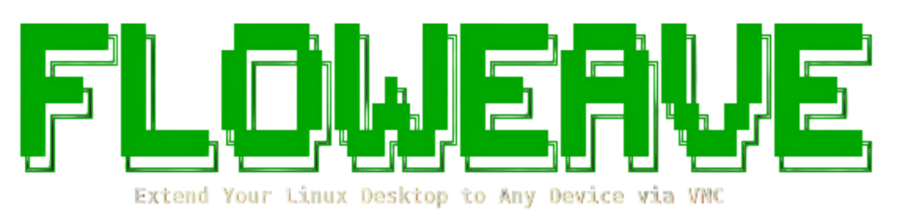

<div align="center">
    
    <br/>
    
    <br/>
    <br/>
    
    <a href="https://github.com/ITx-prash/floweave/releases"></a>
    <a href="https://github.com/ITx-prash/floweave/issues"></a>
</div>

---

<!-- <br/> -->

**Floweave** is a lightweight terminal utility that extends your Linux desktop to a virtual display, allowing you to use any device as a wireless second monitor via VNC.

> [!WARNING]
> <em>Floweave requires an Xorg (X11) session. Wayland is not supported.</em>

## ✨ Features

- **Wireless Display:** Extend your Xorg desktop to any device using VNC.
- **Configurable Output:** Adjust resolution, position, and scaling as needed.
- **Interactive CLI:** Clean, intuitive terminal interface for managing sessions.
- **No Cables Required:** Works seamlessly over your local WiFi network.

## 🚀 Installation

### Quick Start

1.  **Clone the repository:**

    ```bash
    git clone https://github.com/ITx-prash/floweave.git
    cd floweave
    ```

2.  **Run the installer:**

    ```bash
    ./install.sh
    ```

3.  **Launch Floweave:**
    ```bash
    floweave
    ```
> [!IMPORTANT]  
> <em>If the `floweave` command is not found, restart your terminal or run `source ~/.bashrc` (or your shell's config file) to update your PATH.</em>

## 📖 Usage

Floweave offers both a rich interactive menu and a fast command-line interface.

### Interactive Menu

Simply run `floweave` to open the main dashboard:

```bash
floweave
```

From here, you can start/stop the service, configure settings, and view connection details.

### Command Line Interface

For fast operations and scripting:

| Command            | Description                                    |
| :----------------- | :--------------------------------------------- |
| `floweave start`   | Start the virtual display and VNC server       |
| `floweave stop`    | Stop the server and remove the virtual display |
| `floweave config`  | Open the configuration wizard                  |
| `floweave help`    | Show help information                          |
| `floweave version` | Display current version                        |

---

### Uninstall

To remove Floweave from your system:

```bash
rm -rf ~/.local/share/floweave
rm ~/.local/bin/floweave
```

<p align="center">
	
	<br/>
	<em>Crafted with 💚 on GNU/Linux</em>
	<br/>
	Copyright &copy; 2025-present <a href="https://github.com/ITx-prash" target="_blank">Prashant Adhikari</a>
	<br/><br/>
	<a href="https://github.com/ITx-prash/floweave/blob/main/LICENSE"></a>
</p>
