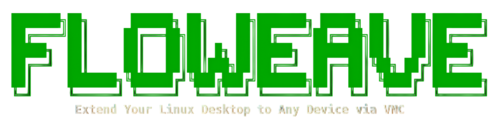

<div align="center">
    
    <br/>
    
    <br/>
    <br/>
    
    <a href="https://github.com/ITx-prash/floweave/releases"></a>
    <a href="https://github.com/ITx-prash/floweave/issues"></a>
</div>

---

<!-- <br/> -->

**Floweave** is a lightweight terminal utility that extends your Linux desktop to a virtual display, allowing you to use any device as a wireless second monitor via VNC.

## ✨ Features

- **Wireless Display:** Extend your Linux desktop to any device using VNC.
- **Display Server Support:** Works on both Xorg (X11) and GNOME Wayland.
- **Configurable Output:** Adjust resolution, position, and scaling as needed.
- **Interactive CLI:** Clean, intuitive terminal interface for managing sessions.
- **No Cables Required:** Works seamlessly over your local WiFi network.

## 📋 Requirements

> [!IMPORTANT]
> Wayland support is currently limited to GNOME (Mutter). Other Wayland compositors (such as KDE Plasma, Hyprland, and Sway) are not supported.

- Linux with an **Xorg (X11)** session or **GNOME Wayland** session (GNOME 40+ with Mutter)
- Both your laptop and second device on the **same WiFi network**
- A **VNC client** app on your second device (such as [AVNC](https://github.com/gujjwal00/avnc) for Android, or [RealVNC Viewer](https://www.realvnc.com/en/connect/download/viewer/) for iOS/Android/desktop)

## 🚀 Installation

### Quick Start

1.  **Clone the repository:**

    ```bash
    git clone https://github.com/ITx-prash/floweave.git
    cd floweave
    ```

2.  **Run the installer:**

    ```bash
    ./install.sh
    ```

    > The installer automatically handles all required dependencies.

3.  **Start Floweave:**

    ```bash
    floweave --start
    ```

    Or run `floweave` to open the interactive dashboard and select **Start Floweave**.

4.  **Connect your device:** Open your VNC client app, enter the IP address and port shown by Floweave (e.g. `192.168.1.x:5900`), and connect.

> [!IMPORTANT]
> <em>If the `floweave` command is not found, restart your terminal or run `source ~/.bashrc` (or your shell's config file) to update your PATH.</em>

## 📖 Usage

Floweave offers both a rich interactive menu and a fast command-line interface.

### Interactive Menu

Simply run `floweave` to open the main dashboard:

```bash
floweave
```

From here, you can start/stop the service, configure settings, and view connection details.

### Command Line Interface

For fast operations and scripting:

| Command                        | Description                                    |
| :----------------------------- | :--------------------------------------------- |
| `floweave --start` / `start`   | Start the virtual display and VNC server       |
| `floweave --stop` / `stop`     | Stop the server and remove the virtual display |
| `floweave --config` / `config` | Open the configuration wizard                  |
| `floweave --help` / `help`     | Show help information                          |
| `floweave --version`           | Display current version                        |

---

### Uninstall

To remove Floweave from your system:

```bash
rm -rf ~/.local/share/floweave
rm ~/.local/bin/floweave
```

<p align="center">
	
	<br/>
	<em>Crafted with 💚 on GNU/Linux</em>
	<br/>
	Copyright &copy; 2025-present <a href="https://github.com/ITx-prash" target="_blank">Prashant Adhikari</a>
	<br/><br/>
	<a href="https://github.com/ITx-prash/floweave/blob/main/LICENSE"></a>
</p>
